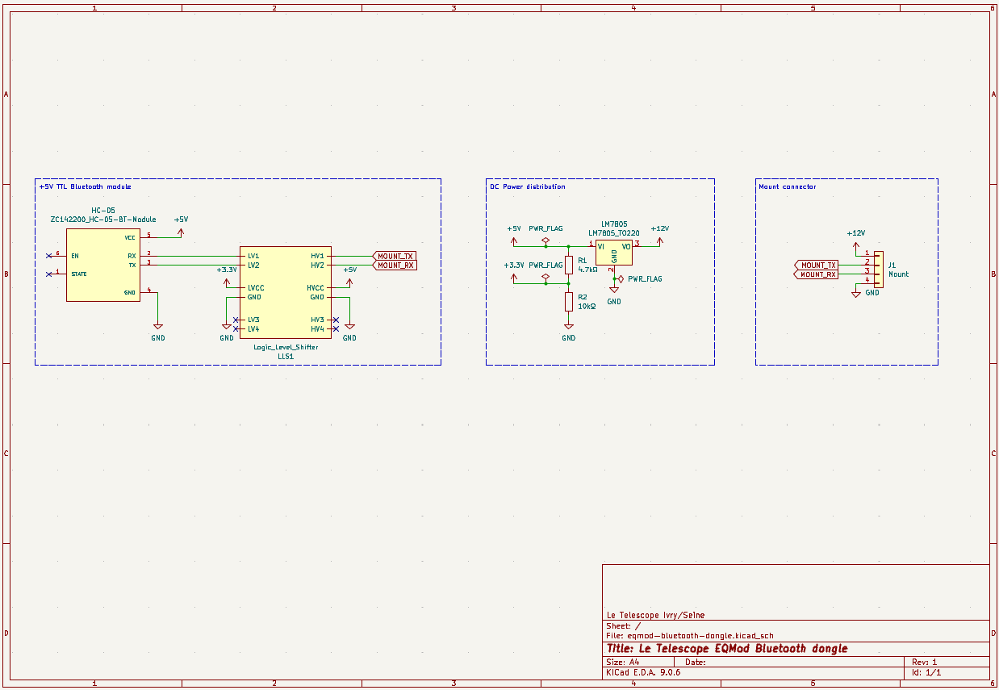
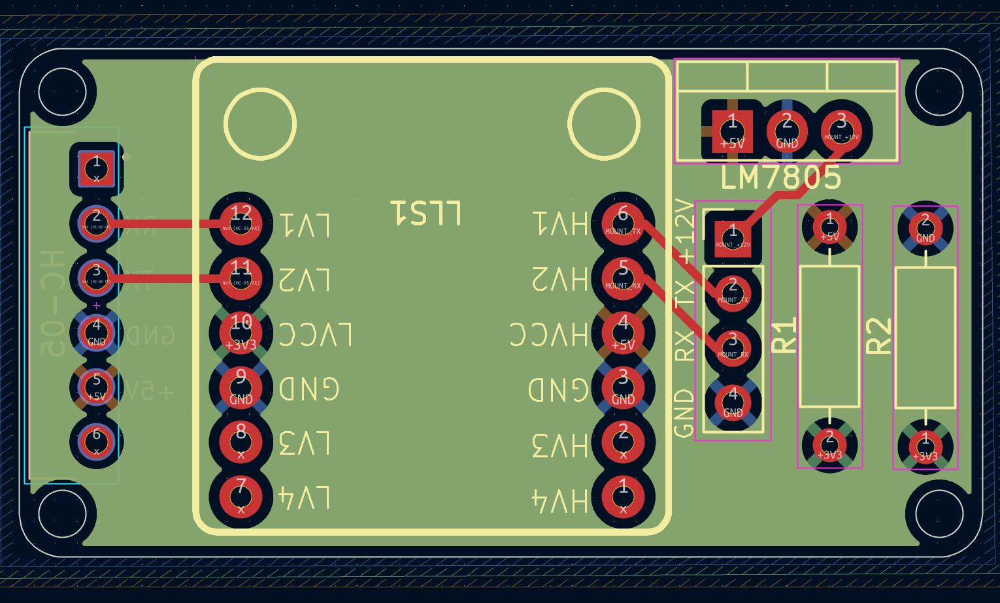

# EQMOD Bluetooth Dongle - Electronics

Schematic diagrams and PCB layouts for the EQMOD Bluetooth dongle can be found in the [electronics/eqmod-bluetooth-dongle/](electronics/eqmod-bluetooth-dongle/) directory.

## Project Files

```markdown
electronics/eqmod-bluetooth-dongle/
├── footprints/                             # Electronic footprint files
├── eqmod-bluetooth-dongle.kicad_pro        # PCB project file
├── eqmod-bluetooth-dongle.kicad_sch        # Schematic file
├── eqmod-bluetooth-dongle.kicad_pcb        # PCB layout file
├── eqmod-bluetooth-dongle.kicad_prl        # PCB rules file
└──README.md                                # This file
```

## Schematic principles

> All this is very much inspired of the official EQDirect-BT schematic available on the [EQMod website](https://eq-mod.sourceforge.net/eqdirectindex.html).

The EQMOD Bluetooth dongle is designed around the HC-05 Bluetooth module, which provides wireless serial communication capabilities. The schematic includes the necessary connections for power, ground, and serial communication (TX/RX) between the HC-05 module and the mount. The design also incorporates level shifting components to ensure compatibility between the HC-05 module's voltage levels and the mount's logic levels.



It consist of three sections:

- The Bluetooth module section: The HC-05 module and the associated logic level shifter to enable +5V TTL signaling with the Mount.
- The Power section: This provides stable voltages
  - +5V from the +12V Mount power supply, using a LM7805 linear voltage regulator.
  - +3.3V from the +5V line, using a voltage divider.
- The mount connection section: A simple generic 4-pin connector to connect to the EQMOD-compatible mount (via wiring to RJ45, RJ12 or DB9 connectors).

## PCB Layout

The PCB design implements the schematic, adhering to a straightforward routing strategy. The power inputs and signals are limited to the top layer, while the bottom layer functions exclusively as a ground plane.



## Bibliography

- EQMod EQDirect-BT documentation: [https://eq-mod.sourceforge.net/eqdirectindex.html](https://eq-mod.sourceforge.net/eqdirectindex.html)
